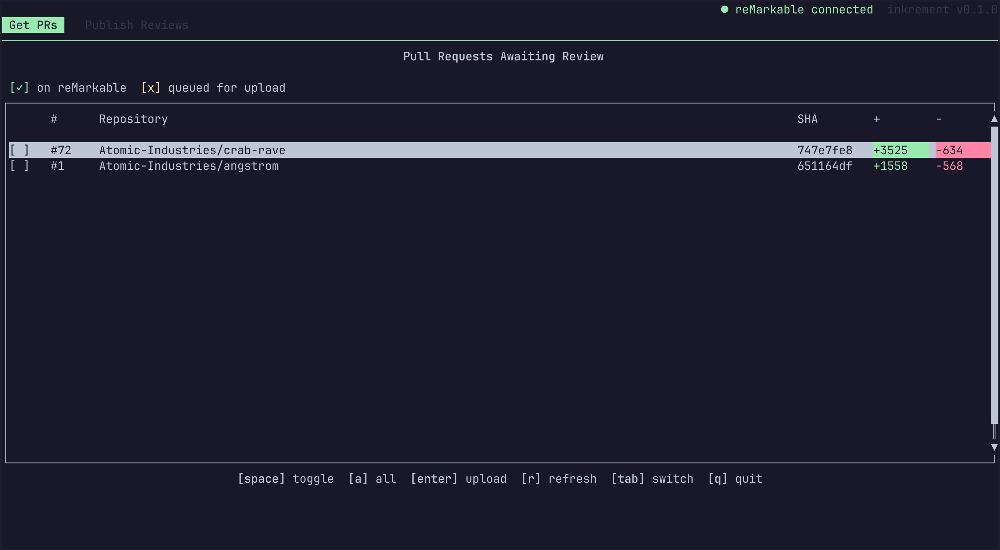
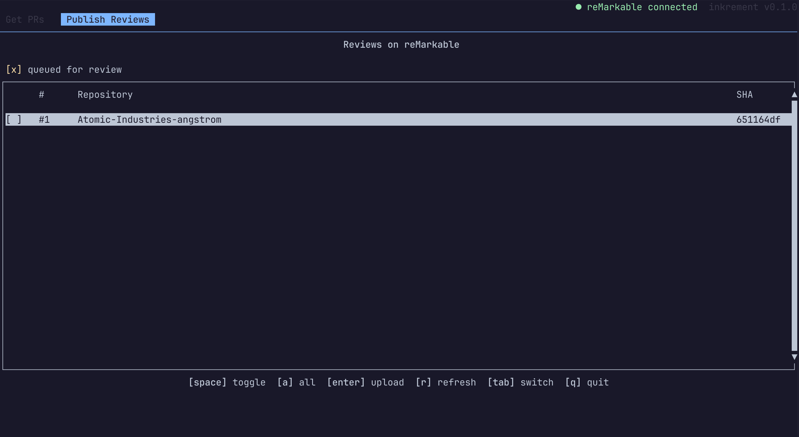

<p align="center">
  
</p>

<br>
<p align="center"><b>Incremental code review, in ink. A reMarkable code review tool.</b></p>
<br>

<div align="center">

  
  
  

</div>

## Prerequisites
Inkrement relies on having a couple of tools installed to work correctly. These are:

1. `gh`: Inkrement currently only works with GitHub, as it relies on the `gh` CLI to interact with
pull requests assigned to your user and post back reviews.
2. `claude`: To convert handwritten comments to text as well as contextualize placement of those comments in the surrounding code (i.e. comment x was placed near line y), the PDFs are parsed using Anthropic's OCR tools.

## Quick Start
### Install
Right now the best way to install is through `cargo`:

```bash
cargo install --git https://github.com/duncanam/inkrement.git
```

Once the tool matures we'll add GitHub actions to publish binaries.

### Use
Connect your reMarkable via USB. Under Settings>Storage, ensure USB communication is enabled.
Then, run `inkrement` to launch the TUI.

## Keybindings
The keybindings, for the most part, are described on the TUI. Here is a full description:

- **[tab]**: swap between PR selection and review publish tabs
- **[space]**: toggle a specific highlighted entry
- **[a]**: select all eligible entries
- **[enter]**: perform operation
    - *PR selection tab*: converts and uploads all selected PRs as review documents to the reMarkable.
    - *Review tab*: downloads review documents, trims off reference-only pages, performs OCR, and publishes review.
- **[r]**: refresh page
    - *PR selection tab*: fetches new PRs and re-scans the reMarkable for pushed PRs to review
    - *Review tab*: re-scans the reMarkable for review documents that have been uploaded and are
    eligible for publishing a review.
- **[q]**: quit Inkrement
- **[Arrow Up]/[Arrow Down]/[j]/[k]**: Navigation up/down for selecting items

## Screenshots

### PR Selection Tab
<p align="center">
  
</p>

### Review Publishing Tab
<p align="center">
  
</p>

## Motivation
In the world of AI, I've found myself reviewing more and more pull requests. I tried converting a
code outline plan to PDF for my reMarkable Paper Pro, and it was a very pleasant experience. I had
increased stamina for review due to an overall reduced fatigue. Additionally, it allowed me to be
more mindful in the moment during my reviews, excusing myself from a notification-filled digital
space and focus on the review to execute it more efficiently. Beyond the material benefits mentioned,
it's also fun and engaging to literally draw on code.

In a rapidly-changing world of software and AI, I like finding ways to cultivate our humanity.

## How it works
1. Inkrement will fetch your pending pull request review requests.
2. You get to then decide which PRs you'd like to pull down to review on your reMarkable.
3. Once you've selected your desired PRs to review, Inkrement parses the diff using the `unidiff`
crate to split the work into tractable hunks.
4. These hunks are then rendered into a PDF using the native Typst Rust API. Full source is also provided
for reference and is hyperlinked near the diffs.
5. The PDF is then transferred to your reMarkable over USB connection. Metadata is embedded in the filename.
6. Perform your markup and review offline.
7. Reconnect your reMarkable. Based on the metadata filename, you'll have the option of downloading
specific reviews.
8. Inkrement will then strip off the reference full source code pages, leaving only your marked-up diff pages.
9. Once the stripped PDF is produced, it's fed to Claude to interpret your handwriting and positioning of
your handwriting.
10. Inkrement will then take the resultant parsed handwriting and position data back from Claude and submit
your PR review.


